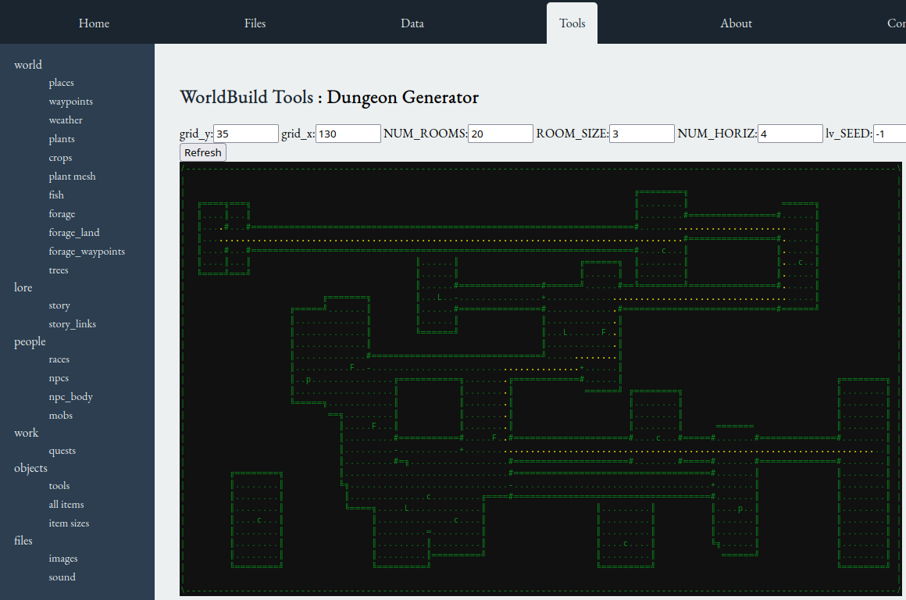
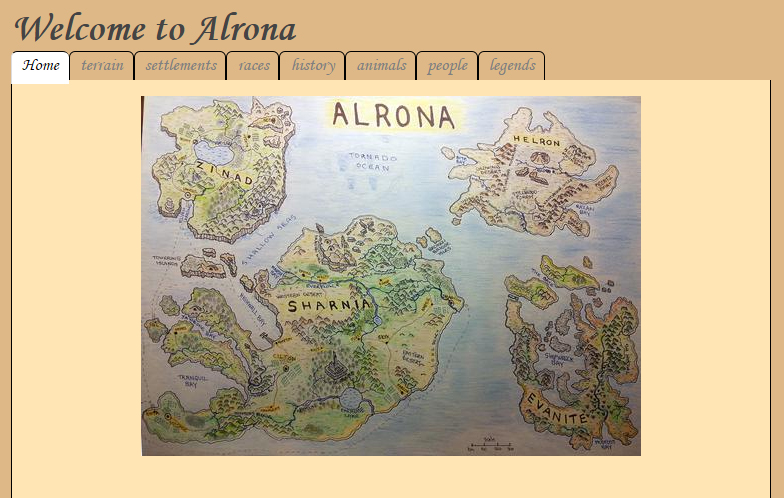

.. image:: https://api.travis-ci.org/repositories/acutesoftware/worldbuild.svg
    :target: https://travis-ci.org/acutesoftware/worldbuild
    :alt: Build Status

=========================================
World Build
=========================================

Desktop app for computational world building (work in progress)

	   

Wiki Page Generation
--------------------------------
Worldbuild contains tools to build worlds and store the metadata around that, including objects, history, animals, vegetation.

You provide a map of your world and annotate it via a YAML file to define towns with locations - the wiki tool extracts subset of the image to for each town.

You can add additional information to build a rich history around your world.

Quick Start
=========================================

Copy your map file (JPG) or scan a hand drawn map.

Create a YAML file with the following sections

.. code:: python

    wiki: Yes
    world_name: Alrona
    contents:
        - races
        - settlements
    maps: [alrona-pen-coloured.jpg]

You need to have a root section for each element in contents, and there needs to be a name and desc element at the minimum.

.. code:: python

    settlements:
      - name: Draeton
        continent: Sharnia
        coords_x_y: [66,58]
        desc: >
            This is the largest city on the East side of Sharnia. 3,000 men live in this strongly
            defended city
      - name: Ambyle
        continent: Sharnia
        coords_x_y: [64,58]
        desc: >
            Farming town East of Draeton, known for their famous weekend markets selling exotic produce grown in the warm regions north of the Eastern Desert

Then modify the params and run the wiki.py program to generate the HTML version of your world.

The main page looks like

The settlements page shows the description from the yaml file, and also a section of the map based on the coords_x_y parameter

You can extend the wiki with as many sections as you like and each entry can include a file section to import a text (or html) file to be included in that page.

Random Grid Generation
============================
Create a random grid as follows

.. code:: python

    pip install worldbuild
    build_random_grid.py

You can convert this grid to a Tiled TMX file for manual editing

.. code:: python

    convert_grid_to_tiled_map.py

Dungeon Map Generator
============================
Create a rogue like dungeon grid by running code below to produce a random map

.. code:: python

    import worldbuild.dungeon_generator as dg

    grid = dg.create_dungeon(grid_y=30, grid_x=80, NUM_ROOMS=16, ROOM_SIZE = 3, NUM_HORIZ = 10)
    print(dg.grid_as_str(grid))

    # optional - make a path through the grid
    print(dg.path_find(grid))

    # optional - export as TMX file
    dg.convert_grid_to_TileEditor_map('dungeon.tmx', 'samples/ascii_runeset.tsx')

    /--------------------------------------------------------------------------------------------------------------------------------\
    |                                                                                                                                |
    |                ╔═══════╗                             ╔════════╗╔═════════════════╗ ╔═══════╗╔═══════╗                          |
    |  ╔════╗══════╗ ║.......║                             ║........║║.................║ ║.......║║.......║ ╔══════╗                 |
    |  ║....║......║ ║.......║                             ║........║║.................║ ║.......║║.......║ ║......║                 |
    |  ║...........║ ║.......║               ╔══════╗      ║........╚╝.................╚═╝.......║║.......#═#......║                 |
    |  ║..!.+......║ ║....r..║               ║......║      ║..............p...L..............L...║║.......-.+......║                 |
    |  ║...........║ ║.......║               ║......║  ╔═══╝....L..................c.............║╝.......#═#...p..║                 |
    |  ║...........║ ║.......║               ║......##═╝.........................................##.......#═#......╚═════╗           |
    |  ╚═╗...L....╔╝ ╚═══════╝               ║......-+.......................-.+.........F.......-+.......-.+............║           |
    |    ║........║                        ╔═╝...F..##...............p..╔════#═#.............╔═══##.......#═#══╗.........║           |
    |    ║........║                        ║........║║....................║     ════╗.................L..╔═════╝.........║           |
    |    ║..═.p...║                        ║........║║......r.............║          ╗...................................║           |
    |    ╚╗...r..╔╝           ╔════════╗   ║........║║....................║          ║...............................p...║           |
    |    ║........║           ║........║   ║........║║................c...║          ║..........r........................║           |
    |    ╚╗...═..╔╝═╗         ║........║  ╔╝....p...║╝....................║          ║......................F............║           |
    |     ║.........║         ║........╚══╝.........║╚═════╗..............║          ║.................p.................║           |
    |     ╚╗........╚═╗═╗     ║.....................║      ║....p.........║          ║...................................║           |
    |      ║..........║.║ ╔═#═╝....................╔╝═══╗  ║..............║          ║...................................║           |
    |      ║.....F..╔═╝═╝ ║.+.................c.........║  ║........╔═════╝          ╚═══════╗..................p........║           |
    |      ║..........║.║ ║.#..........r................╚══╝........╚═════╗                  ║...c...................p...║           |
    |      ║..........║.╚═║.║................................╔═══╗........╚═════╗            ║...........................║           |
    |      ║.........L....║....c.............................║   ║..............║            ║............c..............║           |
    |      ║..............║..╔══╗..........╔═══╗...p.........║   ║..............║            ╚═══════╗...................║           |
    |      ║..........═.╔═╝.═..........╔═══════#.............║   ║..............#════════════════════#..............╔════╝═══╗       |
    |      ╚════╗.........c..-.................+.............║   ║....r.....r...-....................+..............║║.......║       |
    |         ║...........F..#═════════════════#.............║   ║..............#══════╗........╔════#........p.....║║.......║       |
    |         ║...........#..║                  ════╗....r...#═══#..............╚═#═══#╝...........#═╝...........╔══╝║.......║       |
    |         ║...........+..║                      ║........-...+........+.......-...+............-......+......║   ║....r..║       |
    |         ║...c.......#══╝                      ╚╗......╔#═══#════════#..........╔#...............╔═══#══════╝   ║.......╚══╗    |
    |         ║...........║    ╔═══╗════╗            ║......╚═══╗    ║...............║║...............║              ║..........║    |
    |         ║...........║    ║...║....╚═╗═╗        ║..........║    ║...............║║....p...F......║              ║..........║    |
    |         ╚═══════════╝════╝...║......║.║        ║..........║    ║...........r...║║...............║              ╚═══╗......║    |
    |     ╔═══════#══════#.........║......║.╚═══════#╝..........║    ║...............║╝...............#════════════════#═╝......╚══╗ |
    |     ║.......-......+.........║....-...........+.......F...║════╝...............║╚═══╗...........-................+...........║ |
    |     ║.......#══════#................═.╔══════╗............║....................║    ║...........#════════════════#...........║ |
    |     ║.......║     ╔╝...L...........L║.║      ║............║........F..........╔╝    ║.......╔═══                 ║...........║ |
    |     ║.......║═════╝.................║.║      ║........╔═══╝................c..║     ║.......║                    ║...........║ |
    |     ║....p..#.......................#.╚════╗═╝....F...#═══#....p..............#════#........║                    ║...........║ |
    |     ║.......+................p..-...+......║..........-...+...................-....+.....F..║                    ║........?..║ |
    |     ║.......#....................╔══#......║..........#═══#..................╔#════#........║                    ║...........║ |
    |     ║.......║.........r..........║  ║......║.........╔     ════╗.............║..............║                    ║...........║ |
    |     ╚═══════╝....r........c......║  ║..c..╔╝╗.....╔══          ║...r...╔═════╝..............║                    ║...........║ |
    |             ║....................║  ╚══╝...c...F..║            ║.......║     ║............╔═╝                    ║...........║ |
    |             ║.......╔═╗......L...║  ║......║......║            ║.......║     ║............#══════════════════════#...........║ |
    |             ╚═══════  ║..........║  ║......║......║            ╚═══════╝     ║....L.......-......................+...........║ |
    |                       ╚═╗........║  ╚══════╝══════╝                          ║........╔═══#══════════════════════#...........║ |
    |                          ════════╝                                           ╚════════                            ═══════════╝ |
    |                                                                                                                                |
    \--------------------------------------------------------------------------------------------------------------------------------/

It also uses the pathfinding package to make a path through the map

.. code:: python

    Finding path..... Seed was: 5529128865878819600
    pathfind.py start, end =  [5, 5] [123, 38]
    operations: 3459 path length: 168
    /--------------------------------------------------------------------------------------------------------------------------------\
    |                                                                                                                                |
    |                ╔═══════╗                             ╔════════╗╔═════════════════╗ ╔═══════╗╔═══════╗                          |
    |  ╔════╗══════╗ ║.......║                             ║........║║.................║ ║.......║║.......║ ╔══════╗                 |
    |  ║....║......║ ║.......║                             ║........║║.................║ ║.......║║.......║ ║......║                 |
    |  ║...........║ ║.......║               ╔══════╗      ║........╚╝.................╚═╝.......║║.......#═#......║                 |
    |  ║..xx+......║ ║....r..║               ║......║      ║..............p...L..............L...║║.......-.+......║                 |
    |  ║...xx......║ ║.......║               ║......║  ╔═══╝....L..................c.............║╝.......#═#...p..║                 |
    |  ║....x......║ ║.......║               ║......##═╝.........................................##.......#═#......╚═════╗           |
    |  ╚═╗..xL....╔╝ ╚═══════╝               ║......-+.......................-.+.........F.......-+.......-.+............║           |
    |    ║..xx....║                        ╔═╝...F..##...............p..╔════#═#.............╔═══##.......#═#══╗.........║           |
    |    ║...x....║                        ║........║║....................║     ════╗.................L..╔═════╝.........║           |
    |    ║..═xp...║                        ║........║║......r.............║          ╗...................................║           |
    |    ╚╗..xr..╔╝           ╔════════╗   ║........║║....................║          ║...............................p...║           |
    |    ║...x....║           ║........║   ║........║║................c...║          ║..........r........................║           |
    |    ╚╗..x═..╔╝═╗         ║........║  ╔╝....p...║╝....................║          ║......................F............║           |
    |     ║..x......║         ║........╚══╝.........║╚═════╗..............║          ║.................p.................║           |
    |     ╚╗.x......╚═╗═╗     ║.....................║      ║....p.........║          ║...................................║           |
    |      ║.x........║.║ ╔═#═╝....................╔╝═══╗  ║..............║          ║...................................║           |
    |      ║.x...F..╔═╝═╝ ║.+.................c.........║  ║........╔═════╝          ╚═══════╗..................p........║           |
    |      ║.xx.......║.║ ║.#..........r................╚══╝xxxxxxxx╚═════╗                  ║...c...................p...║           |
    |      ║..xxxx....║.╚═║.║...............................x╔═══╗.xxxxxxx╚═════╗            ║...........................║           |
    |      ║.....x...L....║....c..........xxxxxxxxxxxxxxxxxxx║   ║.......xxxx...║            ║............c..............║           |
    |      ║.....xxxx.....║..╔══╗.....xxxxx╔═══╗...p.........║   ║..........x...║            ╚═══════╗...................║           |
    |      ║........x.═.╔═╝.═.........x╔═══════#.............║   ║..........xxxx#════════════════════#..............╔════╝═══╗       |
    |      ╚════╗...xx....c.xxxxxxxxxxx........+.............║   ║....r.....r..xxxxxxxxxx............+..............║║.......║       |
    |         ║......x....F.x#═════════════════#.............║   ║..............#══════╗x.......╔════#........p.....║║.......║       |
    |         ║......x....#.x║                  ════╗....r...#═══#..............╚═#═══#╝x..........#═╝...........╔══╝║.......║       |
    |         ║......xxxxxxxx║                      ║........-...+........+.......-...+.x..........-......+......║   ║....r..║       |
    |         ║...c.......#══╝                      ╚╗......╔#═══#════════#..........╔#.xxxxxxxxxx....╔═══#══════╝   ║.......╚══╗    |
    |         ║...........║    ╔═══╗════╗            ║......╚═══╗    ║...............║║..........x....║              ║..........║    |
    |         ║...........║    ║...║....╚═╗═╗        ║..........║    ║...............║║....p...F.xx...║              ║..........║    |
    |         ╚═══════════╝════╝...║......║.║        ║..........║    ║...........r...║║...........xxx.║              ╚═══╗......║    |
    |     ╔═══════#══════#.........║......║.╚═══════#╝..........║    ║...............║╝.............xx#════════════════#═╝......╚══╗ |
    |     ║.......-......+.........║....-...........+.......F...║════╝...............║╚═══╗..........xxxxxxxxxxxxxxxxxxxx..........║ |
    |     ║.......#══════#................═.╔══════╗............║....................║    ║...........#════════════════#x..........║ |
    |     ║.......║     ╔╝...L...........L║.║      ║............║........F..........╔╝    ║.......╔═══                 ║x..........║ |
    |     ║.......║═════╝.................║.║      ║........╔═══╝................c..║     ║.......║                    ║x..........║ |
    |     ║....p..#.......................#.╚════╗═╝....F...#═══#....p..............#════#........║                    ║xxxxxxxxx..║ |
    |     ║.......+................p..-...+......║..........-...+...................-....+.....F..║                    ║........x..║ |
    |     ║.......#....................╔══#......║..........#═══#..................╔#════#........║                    ║...........║ |
    |     ║.......║.........r..........║  ║......║.........╔     ════╗.............║..............║                    ║...........║ |
    |     ╚═══════╝....r........c......║  ║..c..╔╝╗.....╔══          ║...r...╔═════╝..............║                    ║...........║ |
    |             ║....................║  ╚══╝...c...F..║            ║.......║     ║............╔═╝                    ║...........║ |
    |             ║.......╔═╗......L...║  ║......║......║            ║.......║     ║............#══════════════════════#...........║ |
    |             ╚═══════  ║..........║  ║......║......║            ╚═══════╝     ║....L.......-......................+...........║ |
    |                       ╚═╗........║  ╚══════╝══════╝                          ║........╔═══#══════════════════════#...........║ |
    |                          ════════╝                                           ╚════════                            ═══════════╝ |
    |                                                                                                                                |
    \--------------------------------------------------------------------------------------------------------------------------------/

Optionally, you can uncomment the line to save it as a TMX file for use in Tiled.
Doing this will allow you to use the above grid with a tileset to get better graphics.

Coming soon - better example of tileset graphics
