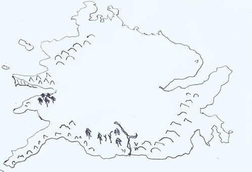

=======================
Journal of Amy Prenz
=======================

*In the 3rd age of Alrona a journal was discovered in a trunk from the stomach of a large Razan found dead near the shores of Sharnia. It was in Elvish written in the hand of the Zinads, and has been translated below.*

*To this date, this is the only information available from anyone who has visited Helron.*

Account of my travels as a rigger on the expedition to explore Helron
======================================================================= 
Our crew are eager and excited to explore the unknown Northern lands, though some are understandably nervous. No one, to our knowledge has attempted such a journey and we are fitting out our crew with full battle gear and all manner of supplies.

The King has provided the latest ship which is larger and stronger than any seen before, though no fanfare is to be made, as the expedition is an exploratory one at this stage. 

The first stage is to get across the typhoon ridden seas, we will then circumnavigate the continent to obtain an accurate map of the Helron shoreline and any visible features.
During this time the warriors will spend the time on intensive fight training so that we are well prepared for the landing.

2301-192: Setting off across the Typhoon Sea
==============================================
We set off from Zinad and travelled East trying to keep close to the South continent of Sharnia as much as possible.

The sea trip was terrifying - never have I seen so many typhoons at one time. As soon as one passed there is another to content with. The ships crew did not rest for days on end as they navigated through the treacherous seas for 160 days.

2302-6: Arrival at Helron!
==================================================
On arrival at the southwest shore of Helron we docked not far, though not close to the shore and rested a day to check supplies, repair damage, etc in case we needed a fast get away.

Looking to the shores it has an eerie fog like cloud over the centre of the land - I had to clean my glasses twice before I realised it was real.

The cartographers were already hard at work mapping what we could see, which at times was little, and the botanists made a brief landing with the warrior squad as backup to collect specimens to study while we took the long trip around the border.

We headed off in a clockwise direction not realising it would take 355 days to return to the same spot.

2302-8: Circumnavigation begins
==================================================
The long trip passed surprisingly quickly, as each hour bought a new glimpse of a previously unseen alien landscape. All crew not on other chores could be seen standing on the edge of the boat peering at the new land, and speculating about what we might discover once we land.

There were no mishaps on the journey and strangely we saw no signs of people, animals or movement of any kind - just the continual persistent fog not far from the shoreline.

I made a rough copy of their completed map below

2302-363: Landing at last
==============================================
The land is not at all pleasant, yet has a haunting, lost desolation that is quite beautiful in an odd way. We have still yet to spot a single bird, animal or insect, so we are lucky we bought complete set of supplies. Even the water is poison - the rivers here taste like acid, and burns lightly on the skin making washing a very brave proposition.

The vegetation at our landing point in the south is similar to Sharnia, though there is a noticeable stuntedness to growth across everything from trees to the grass. 

There is obviously no life in the water, not even fungus and ironically this makes the water utterly clear and quite beautiful. One of the digging crew forgot the warning and jumped in to cool off, but quickly jumped out with what looked like mild sunburn on his entire body, much to the amusement of the rest of the crew.

2303-01: Discovery of the Helron Cave
==============================================
The camp is quite excited as we discovered a cave system today and the initial reports say it leads to massive underground series of halls all linked with additional tunnels going off to who knows where. 

A strongly armed team went into the cave early in the morning and explored 2 of the tunnels but were attacked by some form of ghouls - most died and only 2 returned to base camp. They were too terrified to provide much detail, though did say there was something 'big' living there as well as the ghouls. They also said there were large chests full of jewels and gold made by an unknown race.

As we tended to the wounded and prepared for a rescue of any survivors, the normally deathly silent land was alive with many strange noises - we kept close guard but no direct confrontation occurred.

2303-03: We have to leave
==============================================
The 2 survivors died in the night even though they had minor scratches from the ghouls, so the Captain said we are abandon the lost as they would be dead anyway, and it would be impossible to re-enter with so few remaining crew. 

Our only hope is to return with the information we have and tell the tale. I am deathly afraid - I wish I had never come to this hateful, ghostly land.

4 of the remaining 7 are on night watch while us 3 are resting, but there is no way I will sleep another second here.

I must have dozed off, because I wake suddenly to the sound of horrified screams. The dawn light is just making the sky a grim grey so I went to wake the other 2 but no one else is in the tent. It is now deathly silent and I am sitting here waiting for something. Did they leave without me?

I am utterly terrified - it has been an hour and not a single noise is out there, I have packed my belongings and am ready to go. It is so quiet. The sun has risen fully revealing another foggy looking day in this land, but there is no sign of life as I peep through the tent.

A noise at last! Are they back? No, it turns out to be a large animal walking through the camp rummaging through the supplies and tents - I see it looks like a giant fish but has many legs - it is over 20 feet long. 

I am lucky it isn't Ghouls, so as soon as it is over the other side, I am going to make a run for the boat.

*Journal ends here* 

